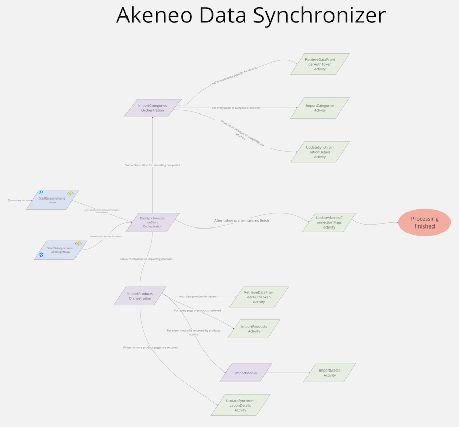

# Shopify Provider 
This project gives an example on how to create a Provider from [Akeneo](https://www.akeneo.com/) to Occtoo onboarding 

**Docs:** https://docs.occtoo.com/docs/get-started/provide-data

The solution has three function pairs working as shown below:



## Running the app
### 1. Get the code
Clone the repository and open the solution
### 2. Add a localsettings.json file and fill out the details of your project (see local.settings.template.json file)
```json
{
  "IsEncrypted": false,
  "Values": {
    "AzureWebJobsStorage": "UseDevelopmentStorage=true",
    "EventHubsConnection": "SingleHost",
    "FUNCTIONS_EXTENSION_VERSION": "~4",
    "FUNCTIONS_WORKER_RUNTIME": "dotnet-isolated",
    "HubName": "datasync",
    "CosmosDbSettings:Uri": "",
    "CosmosDbSettings:PrimaryKey": "",
    "CosmosDbSettings:Database": "akeneoDb",
    "CosmosDbSettings:Container": "akeneo-connections",
    "OcctooDataProviderId": "",
    "OcctooDataProviderSecret": "",
    "LogTableName": "AkeneoImportLog",
    "OnboardingServiceTokenTableName": "OnboardingServiceToken",
    "AkeneoConnectionUsername": "",
    "AkeneoConnectionPassword": "",
    "AkeneoConnectionBase64ClientIdSecret": "",
    "AkeneoConnectionDataProviderId": "",
    "AkeneoConnectionDataProviderSecret": ""
  }
} 
```

### 3. Start the application
Hit F5